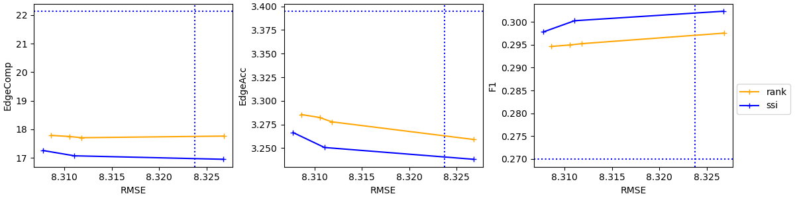

# **User Training**

We provide training illustrations on Unreal4kStereo dataset and CityScapes dataset in this document.

## Dataset Preparation:

Download the dataset from https://github.com/fabiotosi92/SMD-Nets.

Preprocess the dataset following the [instruction](https://github.com/fabiotosi92/SMD-Nets?tab=readme-ov-file#unrealstereo4k) (convert images to `raw` format).

Copy the split files in `./splits/u4k` and organize the folder structure as:

```none
monocular-depth-estimation-toolbox
├── estimator
├── docs
├── ...
├── data (it's included in `.gitignore`)
│   ├── u4k (recommand ln -s)
│   │   ├── 00000
│   │   │   ├── Disp0
│   │   │   │   ├── 00000.npy
│   │   │   │   ├── 00001.npy
│   │   │   │   ├── ...
│   │   │   ├── Extrinsics0
│   │   │   ├── Extrinsics1
│   │   │   ├── Image0
│   │   │   │   ├── 00000.raw (Note it's important to convert png to raw to speed up training)
│   │   │   │   ├── 00001.raw
│   │   │   │   ├── ...
│   │   ├── 00001
│   │   │   ├── Disp0
│   │   │   ├── Extrinsics0
│   │   │   ├── Extrinsics1
│   │   │   ├── Image0
|   |   ├── ...
|   |   ├── 00008
|   |   ├── splits
│   │   │   ├── train.txt
│   │   │   ├── val.txt
│   │   │   ├── test.txt
│   │   │   ├── test_out.txt
│   ├── cityscapes (recommand ln -s)
│   │   ├── camera
│   │   ├── disparity
│   │   ├── extra
│   │   │   ├── camera
│   │   │   ├── disparity
│   │   │   ├── leftImg8bit
│   │   ├── gtFine
│   │   ├── leftImg8bit

```

For CityScapes, please download the dataset from the offical website. Note that we also use the extra dataset to train our models. The data structure is presented above.

## Pre-trained Model Preparation:

Before training and inference, please prepare some pretrained models from [here](https://drive.google.com/drive/folders/1-ScqRuAIxHPxgubdJzC1CDjmJbQK__mD?usp=sharing).

Unzip the file and make sure you have the `work_dir` folder in this repo after that. 

## Model Training:

This repo follows the design of [Monocular-Depth-Estimation-Toolbox](https://github.com/zhyever/Monocular-Depth-Estimation-Toolbox), but it's more flexible in training and inference. The overall training script follows this line of command:

``` bash
bash tools/dist_train.sh ${CONFIG_FILE} ${GPU_NUM} [optional arguments]
```

Arguments Explanation:
- `${CONFIG_FILE}`: Select the configuration file for training
- `${GPU_NUM}`: Specify the number of GPU used for training (We use 4 as default)
- `[optional arguments]`: You can specify more arguments. We present some important arguments here
    - `--log-name`: experiment name shown in wandb website
    - `--work-dir`: `work-dir + log-name` indicates the path to save logs and checkpoints
    - `--tag`: tags shown in wandb website
    - `--debug`: if set, omit wandb log

You will see examples in the following sections.

### Unreal4KDataset Training (Synthetic Data)

Training PatchRefiner includes two steps.

#### Coarse Model Training

We provide the pretrained coarse model at `work_dir/zoedepth/u4k/coarse_pretrain/checkpoint_24.pth`. Check [here](https://github.com/zhyever/PatchFusion/blob/main/docs/user_training.md#coarse-model-training) in case you want to train a coarse model by yourself.

#### Refiner Model Training

Then, run:
``` bash
bash ./tools/dist_train.sh configs/patchrefiner_zoedepth/pr_u4k.py 4 --work-dir ./work_dir/zoedepth/u4k --log-name pr --tag pr
```

Note that the result will over-write the downloaded checkpoint at `work_dir/zoedepth/u4k/pr/checkpoint_36.pth`.

### CityScapes Training (Real Dataset)

There are also two steps for this training.

#### Coarse Model Training

We provide the pretrained coarse model at `work_dir/zoedepth/cs/coarse_pretrain/checkpoint_05.pth`. Check [here](https://github.com/zhyever/PatchFusion/blob/main/docs/user_training.md#coarse-model-training) in case you want to train a coarse model by yourself.

#### Refiner Model Training

Then, run:
``` bash
bash ./tools/dist_train.sh configs/patchrefiner_zoedepth_online_pesudo/pr_ssi_midas_cs.py 4 --work-dir ./work_dir/zoedepth/cs --log-name ssi_7e-2 --tag pr --cfg-options model.edge_loss_weight=7e-2
```

Note that the result will over-write the downloaded checkpoint at `work_dir/zoedepth/cs/ssi_7e-2/checkpoint_02.pth`.

## Model Inference:

### Unreal4KDataset Inference

``` bash
bash ./tools/dist_test.sh configs/patchrefiner_zoedepth/pr_u4k.py 4 --ckp-path work_dir/zoedepth/u4k/pr/checkpoint_36.pth --cai-mode m1 --work-dir work_dir/zoedepth/u4k/pr/vis --save
```

### CityScapes Inference

``` bash
bash ./tools/dist_test.sh configs/patchrefiner_zoedepth/pr_cs.py 4 --ckp-path work_dir/zoedepth/cs/ssi_7e-2/checkpoint_02.pth --image-raw-shape 1024 2048 --patch-split-num 4 4 --cai-mode m1 --work-dir ./work_dir/zoedepth/cs/ssi_7e-2/vis --save
```

### Performance Difference Between Our Paper on CityScapes

- Please check the Boundary Evaluation Protocol Section in our appendix. We follow the protocal when reproducing all the results. The evaluation code will provide all kinds of metrics, including the precision and recall used in our main paper as well as the EdgeAcc and EdgeAcc.

- Note that the current precision and recall are slight different from the ones reported in our paper. The reason is that we used different ways to extract boundaries at that time. For a fair comparison, we aligned it with the implementation in the [MDE challenge](https://jspenmar.github.io/MDEC/).

- Note that the current `EdgeComp` has a magnitude gas compared with the one reported in our paper. The reason is that we only considered real edges close enough to predicted ones at that time. However, it is different from the [MDE challenge](https://jspenmar.github.io/MDEC/)'s implementation. Now, we align the metric with the one used in the [MDE challenge](https://jspenmar.github.io/MDEC/).

- For the cityscapes dataset, we use a larger depth range from 0 to 250m instead of the original 0 to 80m in our paper, as there would be too many boundaries masked out in the 0 to 80m setting.

- The results are ploted on figures. Both ranking loss and ssi loss work well on transfering the detailed knowledge. However, the ssi loss outperforms the ranking loss with a small margin. 


